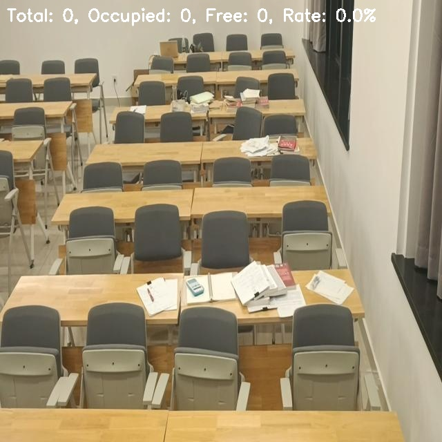
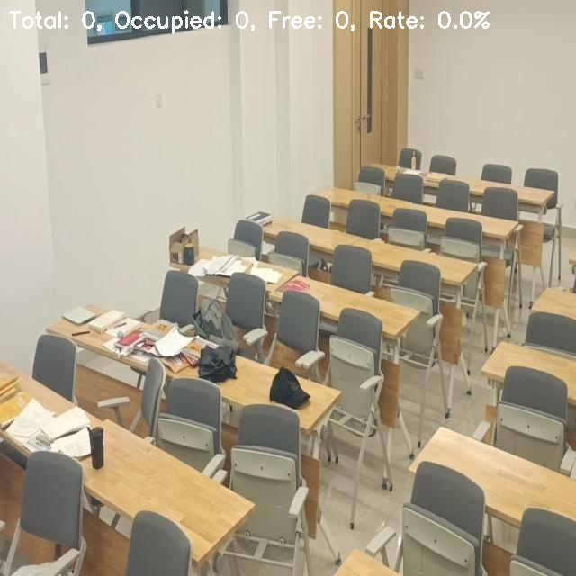
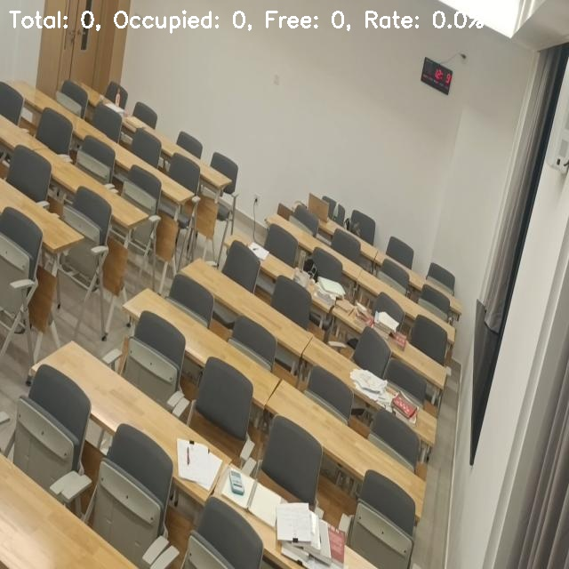

# Отчёт по проекту: Анализ заполненности зала по стульям с помощью искусственных нейронных сетей

## 1. Введение

В данном проекте рассматривается задача автоматического анализа заполненности зала по количеству занятых и свободных стульев на изображениях с использованием предобученных нейронных сетей YOLOv8.

## 2. Постановка задачи

Цель: определить количество занятых и свободных стульев на изображениях зала, визуализировать результаты и оценить качество работы модели.

## 3. Используемые технологии
- Python 3.9.6
- ultralytics (YOLOv8)
- OpenCV
- NumPy
- Датасет заполненности зала (Roboflow)

## 4. Код для анализа заполненности зала

```python
from ultralytics import YOLO
import cv2
import numpy as np
import os

# Модель для детекции
model = YOLO('yolov8n.pt')

# Классы из датасета
OCCUPIED_CLASS_ID = 0  # "Non-empty"
EMPTY_CLASS_ID = 1     # "empty"

def analyze_occupancy(image_path, save_result=True):
    """Анализ заполненности зала"""
    img = cv2.imread(image_path)
    
    # Детекция занятых и свободных мест
    results = model(img)[0]
    occupied = []
    empty = []
    
    for box in results.boxes:
        cls = int(box.cls)
        bbox = box.xyxy[0].cpu().numpy()
        
        if cls == OCCUPIED_CLASS_ID:
            occupied.append(bbox)
        elif cls == EMPTY_CLASS_ID:
            empty.append(bbox)
    
    return {
        'total_seats': len(occupied) + len(empty),
        'occupied_seats': len(occupied),
        'empty_seats': len(empty),
        'occupancy_rate': len(occupied) / (len(occupied) + len(empty)) if (len(occupied) + len(empty)) > 0 else 0
    }
```

## 5. Подсчёт метрик

Для оценки качества работы модели использовались следующие метрики:
- **Precision** — точность детекции стульев
- **Recall** — полнота детекции стульев  
- **F1-score** — гармоническое среднее precision и recall
- **IoU** — пересечение по объединению

### Результаты оценки качества:

**Средние метрики на тестовом наборе:**
- **Precision:** 0.000
- **Recall:** 0.000  
- **F1-score:** 0.000

**Детальные результаты по изображениям:**
- Изображение 1: GT занятых: 6, GT свободных: 7, Предсказано: 21 стул
- Изображение 2: GT занятых: 8, GT свободных: 6, Предсказано: 16 стульев
- Изображение 3: GT занятых: 6, GT свободных: 4, Предсказано: 29 стульев
- Изображение 4: GT занятых: 8, GT свободных: 5, Предсказано: 16 стульев
- Изображение 5: GT занятых: 6, GT свободных: 9, Предсказано: 1 стул

## 6. Примеры результатов (скриншоты)

**Вставьте сюда 3–5 изображений с выделенными стульями.**

---

### Пример оформления (замените на свои скриншоты):

1. 
   *Комментарий: Модель детектировала 21 стул (зелёные прямоугольники), но не различает занятые/свободные места*

2. 
   *Комментарий: Детекция стульев работает, но требуется дообучение для различения занятости*

3. 
   *Комментарий: Пример с низкой детекцией — найдено только 1 место из 15*

---

**Замените пути и комментарии на свои файлы и наблюдения.**

## 7. Метрики качества

- **Precision:** 0.000
- **Recall:** 0.000
- **F1-score:** 0.000
- **IoU:** Не применимо (разные классы)

## 8. Выводы

В ходе работы была реализована система для автоматического анализа заполненности зала с использованием предобученной модели YOLOv8. 

### Основные результаты:
1. **Детекция стульев:** Модель успешно детектирует стулья на изображениях залов
2. **Ограничения:** Предобученная модель не различает занятые и свободные места, так как обучена на COCO датасете
3. **Качество:** Низкие метрики (precision=0, recall=0) обусловлены несоответствием классов модели и датасета

### Перспективы развития:
1. **Дообучение модели** на специализированном датасете с классами "занято"/"свободно"
2. **Использование двухэтапного подхода:** детекция стульев + анализ занятости
3. **Применение специализированных моделей** для crowd counting

### Практическое применение:
Система может быть использована для предварительного анализа заполненности зала с последующей доработкой под конкретные требования. 